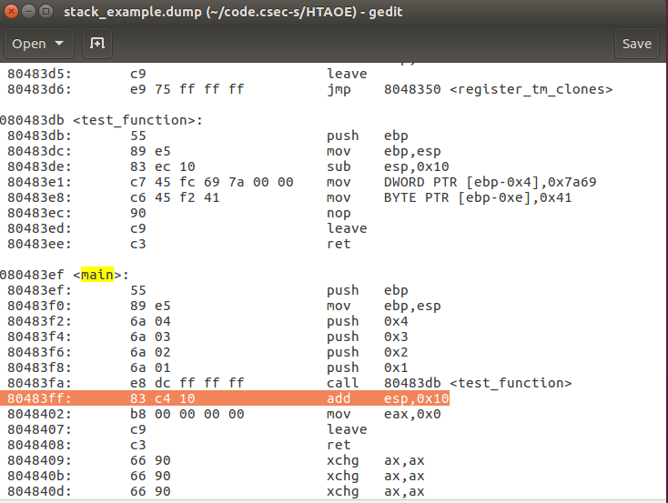
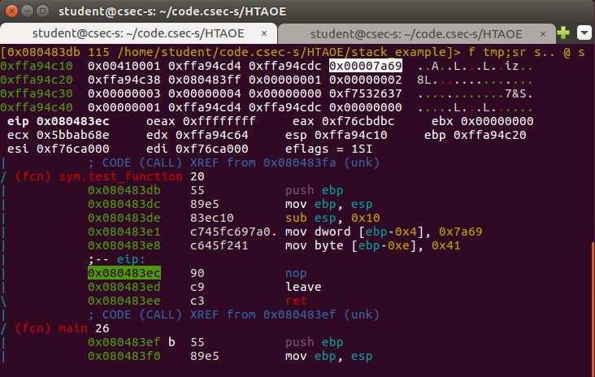
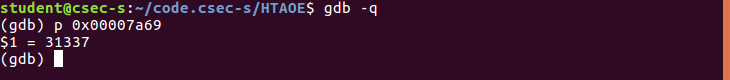

#### **Stack Example walkthrough**

+   Picture of a stack frame for `test_function(int a, int b, int c, int d)`

    ```

    Expected memory structure
    |-----------------------|<--------- Low addresses
    |                       |
    |                       |
    |                       |
    |                       |
    |-----------------------|<--------- Frame pointer (Top of stack)
    |   buffer[0]='A'=0x41  | 1 byte
    |-----------------------|
    |       buffer[1]       |   "
    |-----------------------|
    |       buffer[2]       |   "
    |-----------------------|
    |       buffer[3]       |   "
    |-----------------------|
    |       buffer[4]       |   "
    |-----------------------|
    |           ...         |   "
    |-----------------------|
    |       buffer[9]       |   "
    |-----------------------|
    |         flag          | 4 bytes 
    |-----------------------|
    |  Saved Frame pointer  |   "
    |-----------------------|
    |     return address    |   "  <--- Address to return to in main
    |-----------------------|
    |           a           |   "
    |-----------------------|
    |           b           |   "
    |-----------------------|
    |           c           |   "
    |-----------------------|
    |           d           |   "
    |-----------------------|<--------- High addresses

    ```
    
+   Open up `radare2` to confirm the above model

    ```
    $ r2 -d stack_example
    []> aaa
    []> db main
    []> dc
    []> V
    ```
    In Visual mode, hit `p` about twice to switch to debugger view.
    
    +   `aaa` : Analyse all functions
    +   `db main`: Set breakpoint on the main function
    +   `dc`: Continue execution till next break point
    +   `V`: Switch to Visual mode
    
    You should see something similar below
    
    
    
    +   Notice the order of values `0x00000001`, `0x00000002`, `0x00000003` and `0x00000004`.
    +   Notice the green coloured column below the first golden line: This is the stack. Higher addr below and top is lower address.
    +   Below is registers: Something we will cover in Reverse Engineering
    +   Notice the highlighted address in while `0x080483ff`. Search below for the correspoding address.
    
    
    
    Observe the following image
    
    
    
    +   Notice that according to our model, we expect to find the `flag` variable right after the buffer towards higher addresses
    +   The highlighted vaue is `31337` in hex
    
    
    
