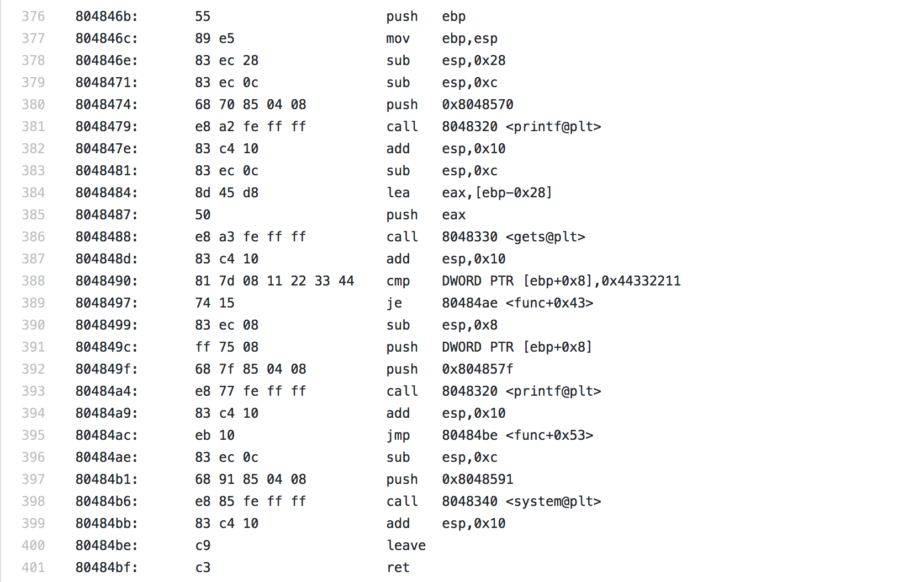

## Reverse Engineering - Introduction

+   Introduction

    

    Reverse Engineering w.r.t software involves any attempt to understand the behaviour of a software by observing peeking at it's binary. Tools such as decompilers, disassemblers and debuggers come in very handy.

+   Recommended texts and Resources

    + Text:

        + [Reversing: Secrets of Reverse Engineering](http://ca.wiley.com/WileyCDA/WileyTitle/productCd-0764574817.html)

        + [Practical Reverse Engineering: x86, x64, ARM, Windows Kernel, Reversing Tools, and Obfuscation](http://ca.wiley.com/WileyCDA/WileyTitle/productCd-1118787315,subjectCd-CSJ0.html)

    + Resources:

        + [Notes](http://www.cs.ucsb.edu/~chris/teaching/cs290/doc/cs290-5-reveng.pdf) by Christopher Kruegel at UCSB

        + [Videos](http://liveoverflow.com/binary_hacking/reverse_engineering.html) by LiveOverflow

        + [Videos: Introductory Intel x86: Architecture, Assembly, Applications, & Alliteration](http://opensecuritytraining.info/IntroX86.html) by Opensecurity Training: Xeno Kovah

+   Legal Aspect

    TL;DR Except where permission is granted, avoid reversing commercial software. The text and resources above, have more details regarding this.

    In this course, we would be using binary provided by me or from public challenge sites such as [Reversing Kr](http://www.reversing.kr)

+   Applications

    + Malware research

    + Bug hunting, POC development

    + Malicious intent: Program key discovery, copyright infrigement etc.

+   Computer Architecture

    +   Fetch -> Decode -> Execute Cycle

    +   Instruction Set cheatsheets

        +   Intel `x84` instruction set.

            +   [Cheatsheet](https://cs.brown.edu/courses/cs033/docs/guides/x64_cheatsheet.pdf) from CS0330 Brown University

        +   Intel `x86` instruction set. 

            +   [Cheatsheet](http://pages.cs.wisc.edu/~remzi/Classes/354/Fall2012/Handouts/Handout-x86-cheat-sheet.pdf) from CS.WISC.EDU Fall 2012

            +   [Cheatsheet](https://scadahacker.com/library/Documents/Cheat_Sheets/Programming%20-%20x86%20Instructions%201.pdf) from SCADAHacker Library

        

    +   Memory Layout

        +   Process Memory

            ```
            0xbfffffff
            |----------------------------------|    -
            |               Stack              |    |  grows downward from high -> low addr
            |                                  |    v
            |----------------------------------|
            |                ...               |
            |                                  |
            |                ...               |
            |----------------------------------|
            |                                  |    ^
            |               Heap               |    |  grows upwards from low -> high addr
            |----------------------------------|    -
            |                                  |
            |        Static and Global         |
            |        ((un)initialized)         |
            |----------------------------------|
            |                ...               |
            |                                  |
            |             Code/Text            |
            |----------------------------------|
            |            0x00000000            |
            |----------------------------------|
            ```

        +   Data sizes

            `char`: 1 byte

            `int`: 4 bytes

            `long`: 8 bytes

            `short`: 2 bytes

            Anything else: use `sizeof` to check

        +   Byte ordering

+   Tools: `r2` as tripple D: Debugger, decompiler, disassembler. `Evans-db` as debugger in anticipation for working in Windows environment
